# 亦多智能视频创作平台架构设计

## 总体方案

应用层（Web/API）
  ↑
领域层（核心业务逻辑 JAVA/Python）
  ↑
基础设施层
├─ AI服务适配器（StableDiffusion/LLM）
├─ 业务层适配器（Spring Cloud）
└─ 存储适配器（S3/MinIO）

```
AI视频创作生态
├─ 创作工具层（技术壁垒）
│  ├─ AI视频生成（对标veed.io）
│  ├─ 智能营销系统（对标imagine.art）
│  └─ 剧本/提示词Agent
├─ 创作者经济层（商业价值）
│  ├─ 作品确权交易（区块链存证）
│  ├─ 素材/模型市场（参考liblib）
│  └─ 会员增值服务
└─ 产业协同层（生态扩展）
   ├─ 影视工业协同（量子合作）
   └─ 教育赋能体系（参考notebooklm）
```

## 设计原则（4S框架）
### 1. Scenario-Driven（场景驱动）
- 用户旅程映射：视频创作→博客名片→资产确权→教育培训→社区分享→会员增值
- 核心场景清单：
  - 多模态视频工作流
  - 素材/模型市场
  - 教育

### 2. Service-Oriented（服务化）
#### 核心服务
| 模块      | 技术栈            | 选择理由         |
| ------- | -------------- | ------------ |
| Web API | Python FastAPI | 开发效率高，生态完善   |
| AI服务    | Python PyTorch | 模型训练/推理原生支持  |
| 异步任务    | Celery + Redis | Python生态成熟方案 |
| 前端      | Next.js / Vue  | 组件化开发，快速迭代   |
| 后端      | Java Spring    | 高性能 高并发 业务平台 |
#### 确权实现方案
1. 数据库版本控制（乐观锁机制）
2. 文件哈希值校验（SHA-256）
3. 操作日志审计（Elastic Search）

### 3. Store-Centric（数据中心）
#### 数据存储策略
| 数据类型    | 存储方案       | 使用场景                | 容量预估             |
| ------- | ---------- | ------------------- | ---------------- |
| 结构化数据   | MySQL 8.0  | 用户信息、订单记录、权限数据      | 100GB            |
| 非结构化数据  | MinIO      | 视频源文件、渲染输出文件        | 1W人 * 1G = 10TB+ |
| 向量数据    | Milvus 2.3 | 视频特征向量、多模态Embedding | 500GB            |
| 缓存/队列数据 | Redis 7.0  | 会话缓存、任务队列、限流计数      | 50GB             |

#### 数据流向示意图
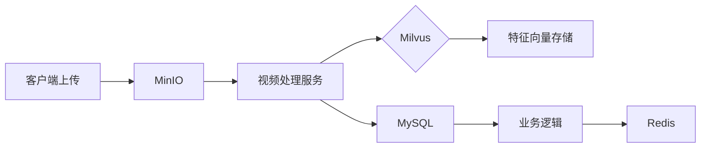

### 4. Scale-Ready（弹性扩展）
水平扩展方案：Kubernetes+Istio服务网格
垂直扩展策略：GPU资源池化调度（NVIDIA vGPU）
混合云架构：核心服务部署在私有云，渲染节点使用公有云Spot实例

## 部署架构
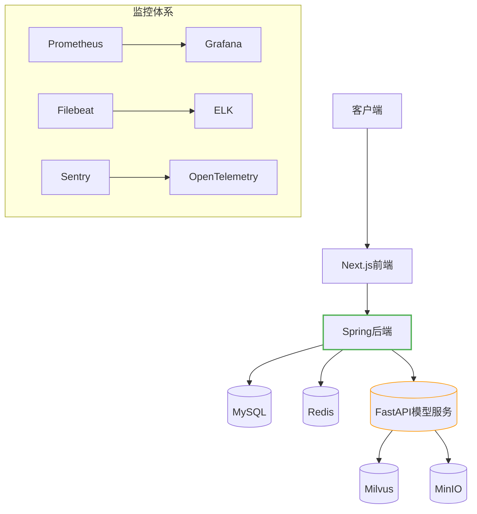

## 质量保障
### 测试策略
- TODO

## Java领域设计（核心业务平台）

### 模块划分与职责
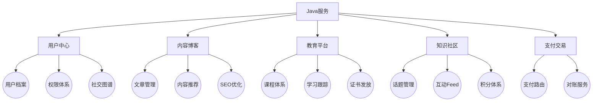

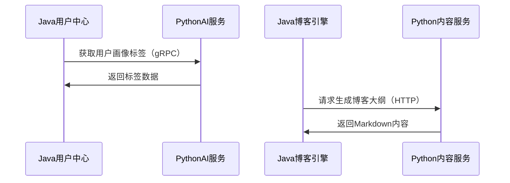

## Python领域设计（AI能力中台）

### 核心能力矩阵
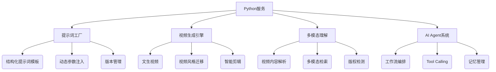

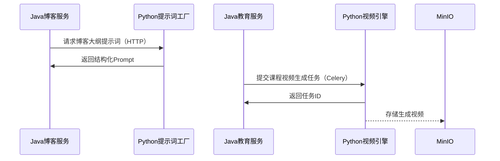

---
## ---

## 方案细化

### 1. Scenario-Driven（场景驱动）

- **用户旅程映射：** 涵盖视频创作→博客名片→资产确权→教育培训→社区分享→会员增值
    
    - 细化用户旅程，增加素材上传、AI模型选择、视频编辑、渲染、发布、互动等环节。
        
- **核心场景清单：**
    
    - 多模态提示词生成（Prompt Engineering）
        
    - 分布式视频渲染工作流
        
    - **新增：**
        
        - 素材智能标签
            
        - 视频智能剪辑
            
        - 互动式教学
            
        - 社区内容推荐
            
        - 区块链确权交易
            

### 2. Service-Oriented（服务化）

#### 核心服务

|          |                         |                      |                               |
| -------- | ----------------------- | -------------------- | ----------------------------- |
| 模块       | 技术栈                     | 选择理由                 | 备注                            |
| Web API  | Python FastAPI          | 开发效率高，生态完善           |                               |
| AI服务     | Python PyTorch          | 模型训练/推理原生支持          | 考虑集成Hugging Face Transformers |
| 异步任务     | Celery + Redis          | Python生态成熟方案         |                               |
| 前端       | Next.js + Tailwind      | 组件化开发，快速迭代           | 考虑使用Vercel部署                  |
| **新增：**  |                         |                      |                               |
| 视频处理服务   | Python (FFmpeg, OpenCV) | 强大的视频处理能力            |                               |
| 区块链服务    | Go (Hyperledger Fabric) | 企业级区块链框架，支持权限控制和隐私保护 | 与国家版权局区块链存证平台对接               |
| 消息队列服务   | Kafka                   | 高吞吐、低延迟，支持流处理        | 用于异步任务、事件驱动、数据同步等             |
| 搜索引擎服务   | Elasticsearch           | 支持全文搜索、结构化搜索和分析      | 用于素材、模型、博客、课程等内容的搜索和推荐        |
| **中间件:** |                         |                      |                               |
| 接口网关     | APISIX/Kong             | API管理、认证授权、流量控制、监控   | 基于Nginx                       |
#### 确权实现方案细化

1. **文件哈希值与元数据提取：
    - 计算文件的SHA-256哈希值（或其他安全哈希算法，如SHA3-256）。
    - 提取文件元数据（Metadata）：如文件名、类型、大小、创建时间、作者信息（用户ID）、可选的描述信息等。
    - 将哈希值和元数据组合成一个结构化的数据对象（如JSON）。
    - 引入IPFS 内容寻址的哈希，确保文件的完整性。
2. **数据库记录（乐观锁）：
    - 在数据库中创建“作品”（或“资产”）表。
    - 表中包含字段：作品ID（唯一标识）、用户ID、哈希值、元数据JSON、版本号（初始为1）、创建时间、更新时间等。
    - 使用乐观锁机制（版本号字段）处理并发更新，防止数据不一致。
3. **操作日志审计（Elasticsearch）：
    - 记录所有与确权相关的操作：创建作品、更新作品信息、下载作品等。
    - 每条日志包含：操作类型、操作时间、用户ID、作品ID、操作详情（如修改前后的数据）等。
    - 使用Elasticsearch便于日志的存储、搜索和分析。
4. **（可选）区块链存证：**
    - 将作品的哈希值和关键元数据（如用户ID、时间戳）写入区块链。
    - 可以使用公有链（如以太坊）或联盟链（如Hyperledger Fabric）。
    - 区块链存证提供更高的公信力和法律效力。
##### **场景：** 用户Alice上传了一个视频文件，并申请确权。

**时序图：**

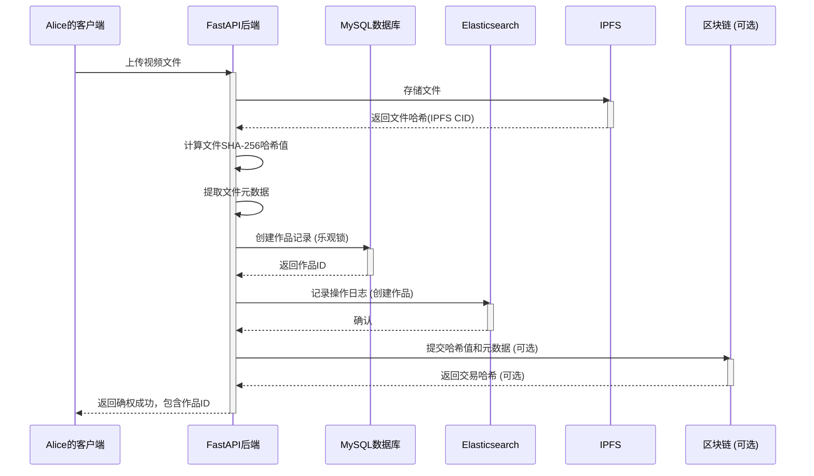

### 3. Store-Centric（数据中心）

#### 数据存储策略

|         |                    |                             |       |                     |
| ------- | ------------------ | --------------------------- | ----- | ------------------- |
| 数据类型    | 存储方案               | 使用场景                        | 容量预估  | 备注                  |
| 结构化数据   | MySQL 8.0          | 用户信息、订单记录、权限数据              | 100GB | 使用主从复制、读写分离提高性能和可用性 |
| 非结构化数据  | MinIO/Ceph/FastDFS | 视频源文件、渲染输出文件、用户上传的素材        | 10TB+ | 根据业务发展情况进行扩容        |
| 向量数据    | Milvus 2.3         | 视频特征向量、多模态Embedding         | 500GB | 用于相似视频检索、内容推荐等      |
| 缓存/队列数据 | Redis 7.0          | 会话缓存、Celery任务队列、限流计数、热门内容缓存 | 50GB  | 使用集群模式提高可用性和性能      |
| **新增：** |                    |                             |       |                     |
| 日志数据    | Elasticsearch      | 用户行为日志、系统日志、操作日志            | 1TB+  | 用于监控、分析、审计          |
| 搜索引擎数据  | Elasticsearch      | 索引数据                        | 500GB | 构建索引 加速搜索           |
| 区块链数据   | Hyperledger Fabric | 存储作品的元数据和交易记录               | 100GB | 保证数据完整性、不可篡改性       |
| 元数据     | MongoDB            | 存储视频、素材的元数据，例如标题、描述、标签、作者等  | 200GB | NoSQL 快速读写          |

#### 数据流向示意图

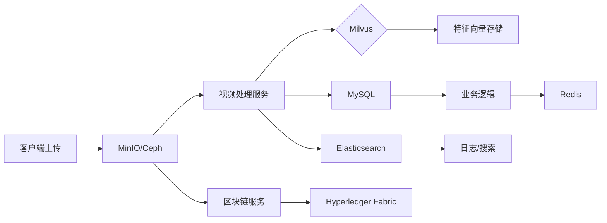

### 4. Scale-Ready（弹性扩展）

- 水平扩展方案：Kubernetes+Istio服务网格
    
    - 使用Kubernetes进行容器编排，实现服务的自动部署、扩缩容和管理。
        
    - 使用Istio进行服务治理，实现流量管理、安全、可观察性等。
        
- 垂直扩展策略：GPU资源池化调度（NVIDIA vGPU）
    
    - 对于AI模型训练和推理，使用GPU资源池化调度，提高资源利用率。
        
- 混合云架构：核心服务部署在私有云，渲染节点使用公有云Spot实例
    
    - 利用公有云的弹性计算资源，降低渲染成本。
        
    - 核心数据和服务部署在私有云，保证安全和可控性。
        
- **新增：**  
    - 数据库：读写分离、分库分表（ShardingSphere/MyCat）。
    
    - 缓存：集群模式。
        
    - 消息队列：集群模式。
        
    - AI模型服务：分布式训练、模型并行、推理加速。
        
    - 视频处理服务：分布式转码、渲染。
        

## 部署架构细化

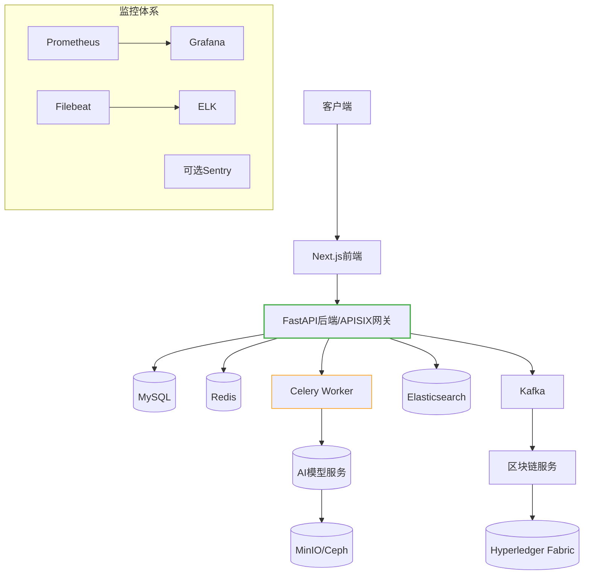

## 质量保障细化

### 测试策略

- **单元测试：** 覆盖核心业务逻辑和关键算法。
    
- **集成测试：** 覆盖服务之间的交互。
    
- **系统测试：** 覆盖端到端的用户场景。
    
- **性能测试：**
    
    - 负载测试：模拟高并发场景，测试系统的吞吐量和响应时间。
        
    - 压力测试：测试系统的极限性能和稳定性。
        
    - 稳定性测试：长时间运行系统，测试系统的稳定性和可靠性。
        
- **安全测试：**
    
    - 漏洞扫描：扫描常见的安全漏洞。
        
    - 渗透测试：模拟黑客攻击，测试系统的安全性。
        
- **A/B测试：** 对比不同版本的功能或设计，选择最优方案。
    
- **灰度发布：**逐步放量用户，降低发布风险
    

## Java领域设计细化（核心业务平台）

### 模块划分与职责

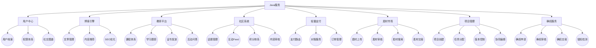


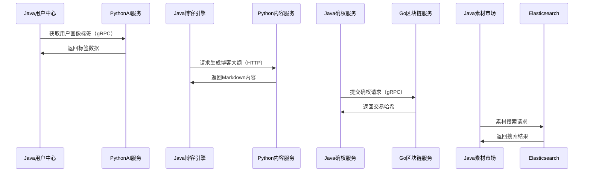

- **技术选型：**
    
    - Spring Boot：快速构建Java应用。
        
    - Spring Cloud：微服务框架。
        
    - MyBatis/JPA：数据库访问。
        
    - Dubbo/gRPC：服务间通信。
        

## Python领域设计细化（AI能力中台）

### 核心能力矩阵

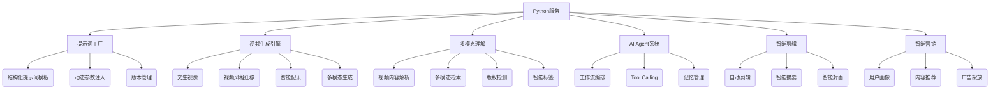

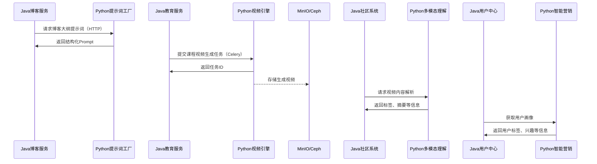


- **技术选型：**
    
    - PyTorch：深度学习框架。
        
    - TensorFlow：深度学习框架。
        
    - FFmpeg：视频处理。
        
    - OpenCV：计算机视觉。
        
    - Hugging Face Transformers：预训练模型库。
        
    - LangChain: Agent开发框架
        
    - FastAPI：Web框架。
        

## 总结和 Roadmap

**技术栈总结：**

- 前端：Next.js, Tailwind CSS, Vercel
    
- 后端：Java (Spring Boot, Spring Cloud, MyBatis/JPA, Dubbo/gRPC), Python (FastAPI, PyTorch, TensorFlow, FFmpeg, OpenCV, Hugging Face Transformers, LangChain), Go (Hyperledger Fabric)
    
- 数据库：MySQL, MongoDB, Milvus, Redis, Elasticsearch, MinIO/Ceph/FastDFS, Hyperledger Fabric
    
- 中间件：Kafka, APISIX/Kong, Nginx
    
- 基础设施：Kubernetes, Istio, Docker, Prometheus, Grafana, ELK, Sentry
    

**Roadmap:**

1. **MVP阶段（2-4个月）：**
    
    - 基础用户系统（注册、登录、个人资料）。
        
    - AI提示词工具。
        
    - 基础视频生成功能（文生视频）。
        
    - 博客系统。
        
    - 教育平台（基础课程）。
        
    - 作品确权（基础功能）。
        
    - 素材库（基础功能）。
        
2. **迭代阶段（4-8个月）：**
    
    - 完善AI视频生成（风格迁移、智能配乐等）。
        
    - 智能剪辑。
        
    - 项目管理与协同。
        
    - 社区系统。
        
    - 完善教育平台（高级课程、互动）。
        
    - 完善确权系统（区块链集成）。
        
    - 素材市场。
        
3. **扩展阶段（8个月以后）：**
    
    - 智能营销系统。
        
    - 多模态理解。
        
    - AI Agent系统。
        
    - 开放平台（API）。
        
    - 国际化。
        

**重点关注：**

- AI模型的训练和优化。
    
- 区块链技术的应用。
    
- 用户体验的持续改进。
    
- 社区生态的建设。
    
- 数据的安全和隐私。
    
- 系统的稳定性和可扩展性。

---

## ---

## 研发阶段规划

**核心思路：**

*   **前期（前3个月，3-5人团队）：** 极简架构，快速上线MVP，验证核心功能和用户需求。
*   **中期（2-6个月，逐步增加到10人）：** 逐步完善功能，优化性能，为用户增长做准备，但不考虑复杂的分布式场景。

### **一、前期架构（前3个月，3-5人团队）**

**1. 设计原则：**

*   **快速迭代：** 优先实现核心功能，快速上线，收集用户反馈。
*   **简单易用：** 技术选型简单，易于开发和维护。
*   **低成本：** 尽量使用免费或低成本的云服务。
*   **聚焦核心：** 只关注最核心的功能：AI提示词，文生视频，基础博客，基础教育平台。

**2. 技术选型：**

*   **前端：**
    *   Next.js + Tailwind CSS
    *   部署：Vercel (简化部署和CDN)
*   **后端：**
    *   Python FastAPI (单体应用)
    *   数据库：MySQL (Heroku/Render等平台提供的托管服务)
    *   AI模型：Hugging Face Transformers (直接调用API或部署轻量级模型)
    *   异步任务：直接使用FastAPI的BackgroundTasks (轻量级) 或 অল্প সংখ্যক 任务可以使用RQ (Redis Queue)
*   **存储：**
    *   对象存储：AWS S3 / Cloudflare R2 (存储视频、图片等)
    *   数据库：MySQL
*   **其他：**
    *   无

**3. 架构图：**

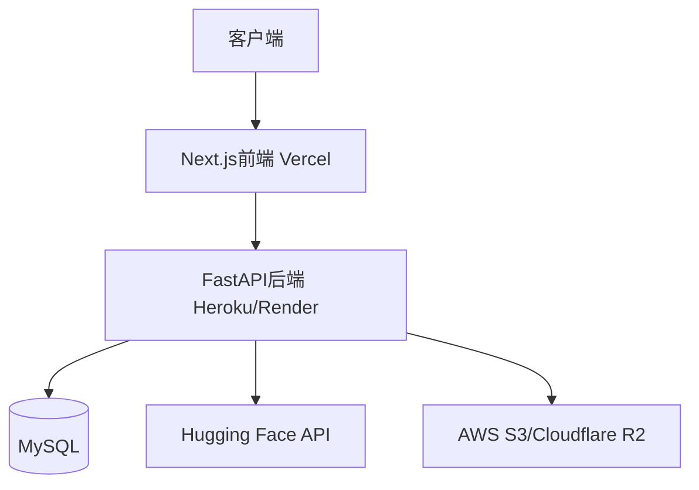

**4. 功能模块：**

*   **用户系统：** 注册、登录、基本信息管理。
*   **AI提示词工具：** 文本生成提示词。
*   **基础视频生成：** 基于模板的文生视频。
*   **基础博客：** 文章发布、评论。
*   **基础教育平台：** 少量视频教程。

**5. 开发计划（粗略）：**

*   **第1个月：** 用户系统、AI提示词工具、基础博客。
*   **第2个月：** 基础视频生成。
*   **第3个月：** 基础教育平台，整合测试，上线。

### **二、中期架构（2-6个月，逐步增加到10人）**

**1. 设计原则：**

*   **功能完善：** 增加更多功能，提升用户体验。
*   **性能优化：** 优化数据库查询、缓存等，为用户增长做准备。
*   **模块化：** 将单体应用逐步拆分为模块，为后续微服务化做铺垫。
*   **可扩展：** 采用一些可扩展的技术，为后续用户增长预留空间。

**2. 技术选型：**

*   **前端：**
    *   Next.js + Tailwind CSS
    *   部署：Vercel
    *   增加：状态管理 (Zustand/Redux Toolkit)
*   **后端：**
    *   Python FastAPI (逐步模块化)
    *   数据库：MySQL (增加读写分离、连接池)
    *   AI模型：
        *   Hugging Face Transformers
        *   逐步部署自己的模型 (CPU推理)
    *   异步任务：Celery + Redis (RabbitMQ备选)
    *   缓存：Redis (用于缓存热门数据、会话等)
*   **存储：**
    *   对象存储：AWS S3 / Cloudflare R2
    *   数据库：MySQL
*   **其他：**
        *   日志：ELK Stack (轻量级部署) / Sentry
        - API网关：APISIX（为后续微服务做准备）
**3. 架构图：**

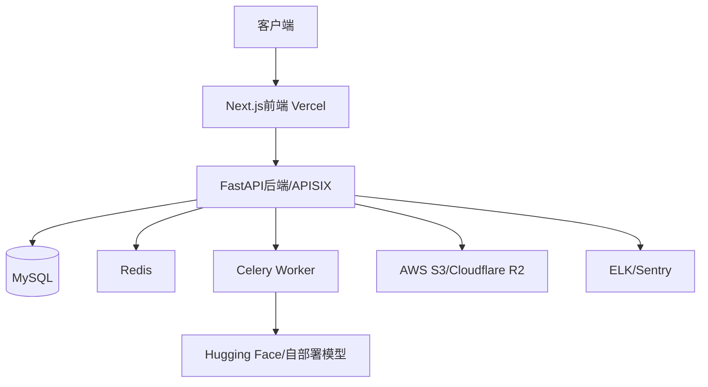

**4. 功能模块：**

*   **原有功能增强：**
    *   用户系统：增加社交登录、头像上传等。
    *   AI提示词工具：增加更多模板、参数配置。
    *   视频生成：增加更多模板、风格迁移。
    *   博客：增加分类、标签、搜索等。
    *   教育平台：增加更多课程、互动问答。
*   **新增功能：**
    *   作品确权（基础版）：记录作品信息、哈希值。
    *   素材库（基础版）：用户上传、分享素材。
    *   视频编辑（基础版）：简单裁剪、拼接。
    *   项目管理（基础）：创建项目，简单任务。

**5. 开发计划（粗略）：**

*   **第4个月：** 作品确权（基础版）、素材库（基础版）、Redis集成。
*   **第5个月：** 视频编辑（基础版）、Celery集成、数据库优化。
*   **第6个月：** 项目管理（基础）、持续优化和迭代。

**关键说明：**

*   **单体应用：** 中期仍然保持单体应用，但进行模块化，为后续微服务化做准备。
*   **不考虑分布式：** 不引入复杂的消息队列（如Kafka）、分布式数据库等。
*   **逐步增加团队：** 逐步增加开发人员，可以开始引入初级测试人员。
*   **为后期做准备：** 虽然不直接实现分布式，但技术选型和架构设计要考虑可扩展性。

**三、人员安排：**

* **前期（3个月）：**
    *   前端：1-2人（1名中级，0-1名初级或实习）
    *   后端：2人（1名高级，1名中级）
    *   UI：1人（可兼职）
    *   算法：1人（兼职或顾问）

* **中期（2-6个月）：**
	*   前端: 2人
	*    高级：1名（负责整体架构设计和核心模块开发）
	*    中级：1名（负责具体模块开发和优化）
	*   后端：4人
	*    高级：1名（负责后端架构设计和核心接口开发）
	*    中级：2名（负责数据处理、AI接口和业务逻辑实现）
	*   AI工程师：
	*    中级：1名 （负责AI agent工具 和 确权服务的底层模型维护和优化）
	*   测试工程师：
	*    初级：1名（负责功能测试）
	*   UI设计师：1名

