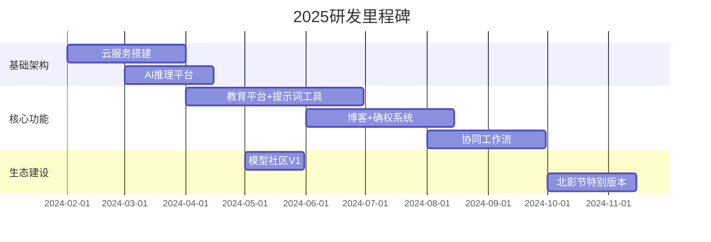

## 背景
https://mubu.com/app/edit/home/7I0ZgyARjgk

## 一、业务方向定位

```
AI视频创作生态
├─ 创作工具层（技术壁垒）
│  ├─ AI视频生成（对标veed.io）
│  ├─ 智能营销系统（对标imagine.art）
│  └─ 剧本/提示词Agent
├─ 创作者经济层（商业价值）
│  ├─ 作品确权交易（区块链存证）
│  ├─ 素材/模型市场（参考liblib）
│  └─ 会员增值服务
└─ 产业协同层（生态扩展）
   ├─ 影视工业协同（量子合作）
   └─ 教育赋能体系（参考notebooklm）
```
## 二、核心价值模块评估

| 模块层级 | 核心模块     | 价值权重  | 研发难度 | 竞品差异点         |
| ---- | -------- | ----- | ---- | ------------- |
| 技术壁垒 | AI视频生成引擎 | ★★★★★ | 高    | 集成工作流+游戏化交互   |
|      | 智能营销系统   | ★★★★☆ | 中    | 结合用户画像的自动化投放  |
| 商业变现 | 确权交易系统   | ★★★★☆ | 中    | 区块链存证+分成机制    |
|      | 模型素材市场   | ★★★☆☆ | 低    | 社区驱动型UGC生态    |
| 用户粘性 | 项目管理协同   | ★★★★☆ | 高    | boardmix式白板协作 |
|      | 教育知识库    | ★★★☆☆ | 中    | 结构化课程+实战案例    |
## 三、竞品对标分析

1. **Veed.io**（工具层）
    - 优势：浏览器端轻量化视频编辑
    - 可借鉴：小白用户引导系统
    - 超越点：增加AI编剧+多模态生成
2. **Imagine.art**（生成层）
    - 优势：艺术风格化生成效果
    - 可借鉴：模型微调体系
    - 超越点：结合影视工业工作流
## 四、研发资源配置

### （一）人员配置规划
#### 前期
| 岗位  | 人数   | 级别分布  | 关键能力要求              |
| --- | ---- | ----- | ------------------- |
| 前端  | 1～2人 | 中级1～2 | JS/WebGL、协同编辑、游戏化交互 |
| 后端  | 2人   | 高级2   | 视频处理引擎、区块链开发、AI模型部署 |
| 算法  | 1人   | 高级1   | 多模态生成、推荐算法、NLP      |
#### 后期

| 岗位  | 人数  | 级别分布        | 关键能力要求              |
| --- | --- | ----------- | ------------------- |
| 前端  | 4人  | 高级1+中级2+初级1 | JS/WebGL、协同编辑、游戏化交互 |
| 后端  | 5人  | 高级2+中级2+初级1 | 视频处理引擎、区块链开发、AI模型部署 |
| 算法  | 3人  | 高级2+中级1     | 多模态生成、推荐算法、NLP      |
| 测试  | 2人  | 中级2         | 压力测试/AB测试专家         |
| 运维  | 2人  | 中级2         | 视频云架构、GPU集群管理       |
### （二）核心模块开发估算
A方案

| 模块         | 预估工期（人日） | 优先级 |
| ---------- | -------- | --- |
| 教育平台       | 40       | 高   |
| 博客         | 30       | 高   |
| 素材库/知识库    | 35       | 高   |
| Agent AI工具 | 50       | 高   |
| 确权         | 45       | 高   |
| 用户系统       | 20       | 高   |
| **总计**     | **220**  |     |
B方案

| 模块     | 人日   | 关键难点         |
| ------ | ---- | ------------ |
| AI视频引擎 | 80PD | 多模型调度、实时渲染优化 |
| 协同工作流  | 60PD | 冲突解决算法、操作追溯  |
| 确权系统   | 40PD | 区块链节点设计、存证合规 |
| 教育平台   | 30PD | 知识图谱构建、实训环境  |
| **总计** | 210  |              |

### （三）阶段实施计划



## 五、风险控制建议

1. **技术风险**：视频生成模块建议采用Stable Video Diffusion+自研优化方案双轨推进
2. **合规风险**：确权系统需提前对接国家版权局区块链存证平台
3. **成本风险**：GPU云服务采用混合部署模式（自建集群+阿里云弹性扩容）
